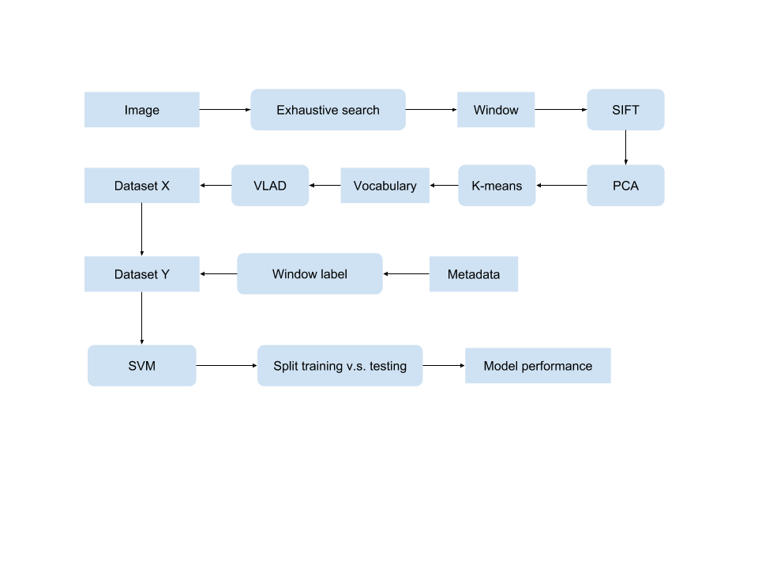

# CML_Project
Jiacheng Liao and Kun Liu

A machine learning project focused on object classification and localization on images

Designed and developed an image batch processing pipeline to produce input dataset for models

Implemented own version of K-Means algorithm to learn vocabularies of images

Data pipeline workflow:

